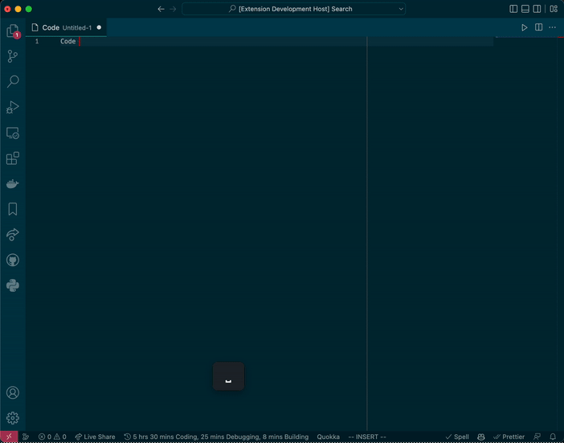

# simple-cheatsheet README

## Features

Basic peaking functionality for a html cheat sheet for VSCode. Default
keybinding is `Ctrl+F1` for Windows/Linux and `Cmd+F1` for Mac to toggle showing
the page.

## Extension Settings

This extension contributes the following settings:

* `simple-cheatsheet.cheatSheetFile`: Absolute filepath to the cheat sheet html
  file. Default `null` which shows an example sheet.

## Release Notes

### 0.0.2

Fix broken deployment.

### 0.0.1

Initial release of simple-cheatsheet.
